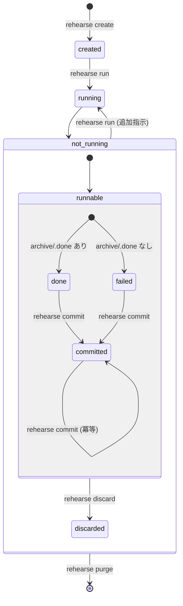

# セッションのライフサイクル

## 状態遷移



## 状態の定義

| 状態 | 説明 |
|---|---|
| `created` | `rehearse create` が workspace を構築した直後、まだ `run` していない |
| `running` | コンテナが稼働中 |
| `done` | `archive/.done` が存在する状態で container 正常終了 |
| `failed` | `archive/.done` なしで container 終了 (agent の自主終了 / timeout / crash をまとめたもの。終了理由は `meta.json` の `exit_reason` に記録) |
| `committed` | `commit` が完了し、実ファイルが A→B に移動済み |
| `discarded` | `discard` が実行された (実ファイルは無傷、workspace は audit として残る) |
| `purged` | workspace が物理削除された |

`done` と `failed` の区別は重要。 `done` は「 agent が自分で完了と判断した」正常系。 `failed` は agent が完走しなかった異常系で、レビュー時に扱いを変えることがある。 harness の挙動 (commit/discard/run) は両者で同じなので、状態としては 2 つに畳んでいる。

## コマンド

ハーネスが提供する CLI:

### `rehearse create <A> <B>`

- 新しい workspace を作成
- `data/` 配下に `refs/{a,b}` symlink、`inbox/`, `archive/` を構築
- `meta.json` を書き出し
- `.gitignore` を書き、 `data/` の初期状態を git にスナップショット (レビュー用、詳細は [architecture.md](architecture.md) の「セッション開始時フック」節)

### `rehearse run <session> [-m <message>]`

- 外部 runner script (`scripts/run-agent-cc.sh`、 `REHEARSE_AGENT_RUNNER` で差し替え可) を起動し、終了まで block
- runner は内部で `docker run --rm` を組み立てて agent コンテナ (既定 `rehearse-agent:latest`) を回す
- agent (Claude Code) は entrypoint 内で `timeout ${REHEARSE_AGENT_TIMEOUT} claude --print --permission-mode bypassPermissions ...` として起動される
- 終了後、 `meta.json` の状態と `exit_reason` を更新
  - exit 0 + `archive/.done` あり → `done` (`exit_reason="normal"`)
  - exit 124 / 137 → `failed` (`exit_reason="timeout"`)
  - その他 → `failed` (`exit_reason="exit=N"`)

`--rm` を付けるので container は毎回使い捨て。会話履歴は workspace の `home/agent/.claude/...` (= container の `/home/agent`) に永続化される。 harness ↔ runner 間の env 契約と timeout の扱いは [architecture.md](architecture.md) の「agent runner」節を参照。

**再実行** (`done` / `failed` からの再 run):

`done` または `failed` の session に対して `run` を呼ぶと、 entrypoint が会話履歴の存在を検出して Claude Code を `--continue` モードで起動する。 harness 側に「再開」という概念はなく、初回か再開かの判定は entrypoint に閉じている。

**追加指示の渡し方** (`-m`):

- `-m "text"` で agent にメッセージを渡す — 初回でも再実行でも使える
  ```bash
  rehearse run 1744296235 -m "ジャズは year/artist ではなく label/catalog 順で並べて"
  ```
- 省略時はデフォルトメッセージが使われる

### `rehearse status [<session>]`

- 引数なし: 全セッションの一覧 (id, 状態, 起動時刻, A / B の要約)
- セッション指定: `meta.json` の内容 (状態、タイムスタンプ、 exit reason 等) を表示

配置計画そのもののレビューは `git status` / `git diff` / `ls` / `less` 等を直接使う (「レビュー手順」節参照)。 `status` コマンドはセッション管理に徹し、 content には踏み込まない。

### `rehearse commit <session>`

- `archive/` の symlink を辿って実ファイルを A→B に rename
- 冪等な実装 (中断しても再実行で残りを処理)
- `meta.json` の status を `committed` に更新
- 詳細: [commit.md](commit.md)

### `rehearse discard <session>`

- 何もしない (実ファイルは無傷)
- `meta.json` の status を `discarded` に更新
- workspace は残る (audit 記録として)

### `rehearse purge <session>`

- workspace を物理削除
- どの状態からでも実行可能 (`committed` / `discarded` / エラー終了後 等)
- 実ファイルへの影響なし

## 規約: `.done`

agent は全ての配置を完了したと判断した時点で `archive/.done` (空ファイルでも可) を作成して終了する。

- **正常終了のシグナルに限定**: 異常系は経路が多様で信頼できない。正常系だけで確実に起きることを signal にする
- `.done` がない状態で container が終了していたら `abort` / `timeout` / `crash` のいずれか
- レビュー時、 `.done` の有無で色分けすると事故防止になる

## 規約: `.FYI.md`

agent は配置の判断理由や Web 検索で得た情報を `.FYI.md` として `archive/` 内に残せる。

**配置パターン** (どちらでもよい):

```
archive/music/
  foo/
    bar.flac                        # symlink
    bar.flac.FYI.md                 # 個別ファイル単位の補足
  baz/
    FYI.md                          # ディレクトリ単位の補足
    qux.flac                        # symlink
```

**性質**:

- `.FYI.md` は **実ファイル**であり symlink ではない
- commit 時に B には**移動しない**: workspace 内にそのまま残る (audit 記録)
- レビュー時の判断材料として読める
- 必須ではない: agent が必要と判断した場所にだけ書く

## 規約: transcript

Claude Code は会話ログを `~/.claude/projects/...` に出力する。ハーネスはセッション終了時にこれを workspace の `transcript.jsonl` にコピーする。

- レビュー時に「なぜその配置にしたか」を遡れる
- `.FYI.md` とは別次元の情報 (transcript は全行動の記録、 `.FYI.md` は agent 自身が選んだダイジェスト)
- 両方あると相互補完になる

## レビュー手順

`rehearse status` はセッションの現状と transcript の要約を示すが、 **配置計画そのもののレビューは git で行う**。 `rehearse create` の時点で `data/` の初期状態が git にスナップショットされているので、 agent が動かした分だけが差分として浮かび上がる。

通常の動線:

```bash
cd /opt/rehearse/sessions/<id>
git status                     # 変更された symlink / 追加された実ファイルの一覧
git diff                       # target (= プロビナンス) の変化を読む
cat data/archive/**/FYI.md           # agent が残した補足を拾う (あれば)
less data/transcript.jsonl     # 判断根拠を遡りたいとき
```

- symlink の blob は target 文字列そのままなので、 `mv` だけの移動は rename 検出が自動で効く
- `.FYI.md` や `.done` も実ファイルとして自然に `git status` に出てくる
- tig / lazygit / gitui / VS Code など、好みのレビュー UI をそのまま使える

納得したら `rehearse commit`、そうでなければ `rehearse discard`。 git リポジトリは rehearse の動作に関与しないので、レビュアーが自由にブランチを切って試しても構わない。

## コミット後の workspace の姿

`commit` 実行後、workspace はこのような状態になる:

- `inbox/` の symlink は dead (target の実ファイルが B に移動したので壊れている)
- `archive/` の symlink も dead (同上)
- ただし symlink **自体** (文字列) と `.FYI.md` は残る
- `readlink inbox/foo.flac` → `/opt/rehearse/sessions/<id>/refs/a/foo.flac` (文字列としては読める)
- 「元は A のどこにあって、 agent が B のどこに置こうとしたか」の記録が完全に残る
- 後日の振り返り、ルール改善、学習データとして使える

物理コストは symlink 1 個あたり数十バイト。 10k ファイルでも 1MB 未満なので、古いセッションを残しておくコストは無視できる。
