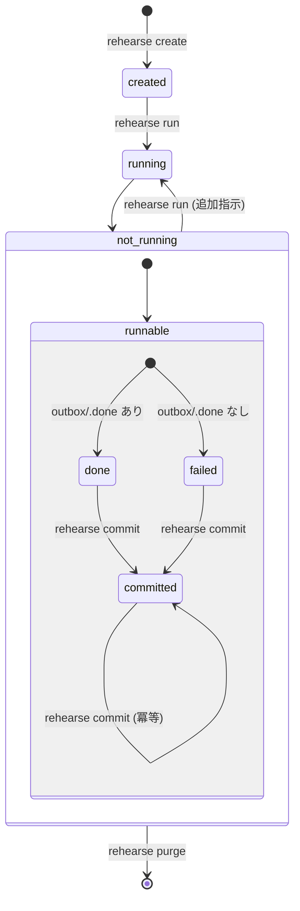

# Sessions

## ディレクトリレイアウト

1 セッション = 1 ディレクトリ。セッション終了後も audit 記録として残す (物理削除は `purge` コマンドで明示的に実行)。

```
~/.local/share/rehearse/sessions/<session-id>/
├── .git/                    # レビュー用スナップショット (harness 所有、 agent 視界外)
├── .gitignore               # data/ 以外を除外
├── meta.json                # 起動時刻, A の実パス, B の実パス, scope, status
├── commit.log               # commit 時に追記
└── data/                    # agent work dir。コンテナにマウントされる唯一のサブツリー
    ├── refs/
    │   ├── a -> /host/path/A    # A への symlink (read-only 参照)
    │   └── b -> /host/path/B    # B への symlink (read-only 参照)
    ├── inbox/               # A のミラー (agent の未処理プール)
    └── outbox/              # B のミラー + agent の配置計画
        └── .done            # 正常終了時にエージェントが作る
```

`<session-id>` は既定では UNIX 秒 (`1744296235` のような 10 桁文字列)。ソート可能で短いので、 symlink target に繰り返し現れても agent の入力トークンやレビュー負荷を圧迫しない。秒内衝突は `mkdir(2)` の atomicity で検知して +1 retry する。`rehearse create -s SID` を使うと任意の名前付き session id を指定できる。使える文字は profile 名と同じ英数字、 `_`、`-`、`.` で、既存 session との衝突時は上書きせず失敗する。

以降、`sessions/<id>/data/` を **agent work dir**、`sessions/<id>/home/agent/` を **agent home** と呼ぶ。実ディレクトリ名は短く保ち、役割名で意味を補う。

## セッション作成

`rehearse create` は `$REHEARSE_ROOT/profiles/<profile>.json` を読み込み、raw profile を `meta.json` に転記する。`-p` 未指定時は `default` profile を使い、`profiles/default.json` がなければ `{}` で自動作成する。

session id は `-s` 指定時はその値を使い、未指定時は UNIX 秒ベースで自動採番する。session directory には agent work dir (`data/`) と agent home (`home/agent/`) を作る。`data/` には `refs/{a,b}` symlink、`inbox/`、`outbox/` を構築し、agent home には profile の `skeleton` で指定された `$REHEARSE_ROOT/skeletons/<name>/` をコピーする。

最後に `meta.json` を書き出し、レビュー用に `data/` の初期状態を git snapshot として保存する。snapshot の扱いは [review.md](review.md) を参照。

## 状態遷移



## 状態の定義

| 状態 | 説明 |
|---|---|
| `created` | `rehearse create` が session directory を構築した直後、まだ `run` していない |
| `running` | セッションの run lock が保持され、agent runner が稼働中 |
| `done` | `outbox/.done` が存在する状態で agent runner 終了 |
| `failed` | `outbox/.done` なしで agent runner 終了 (agent の自主終了 / timeout / crash をまとめたもの。終了理由は `meta.json` の `exit_reason` に記録) |
| `committed` | `commit` が完了し、実ファイルが A→B に移動済み |

`done` と `failed` の区別は重要。 `done` は「 agent が自分で完了と判断した」正常系。 `failed` は agent が完走しなかった異常系で、レビュー時に扱いを変えることがある。 harness の挙動 (commit/run) は両者で同じなので、状態としては 2 つに畳んでいる。

`running` は特殊で、 `meta.json` に永続化する静的状態ではない。 `sessions/<id>/run.lock` が `flock` で保持されている間だけ、コマンドはその session を `running` と見なす。これにより `Ctrl+C`、端末切断、 runner crash などでプロセスが消えれば lock も解放され、次のコマンドが stale な `running` に閉じ込められない。 `meta.json` に `running` が保存されていた場合は不正な session state として扱う。

## 実行と finalization

`rehearse run` は `meta.json` に転記済みの profile に既定値を適用し、外部 runner script を起動して終了まで block する。runner は `sessions/<id>/run.lock` を `flock` で保持しながら agent コンテナを回す。agent は entrypoint 内で `timeout ${REHEARSE_AGENT_TIMEOUT} <agent-cli> ...` として起動される。

runner 終了後、harness は exit code と `outbox/.done` の有無から `meta.json` の状態と `exit_reason` を更新する。

| 条件 | 状態 | `exit_reason` |
|---|---|---|
| `outbox/.done` あり | `done` | `normal` |
| exit 124 / 137 | `failed` | `timeout` |
| その他 | `failed` | `exit=N` |

`debug` は `run` と同じ agent image、mount、UID/GID、`run.lock`、finalization 経路を使う。違いは Docker entrypoint だけをユーザー指定の `CMD` に差し替える点。手動操作で `outbox/.done` を作れば `done`、なければ exit code に応じて `failed` になる。

## 再実行と追加指示

`done` または `failed` の session に対して `run` を呼ぶと、entrypoint が会話履歴の存在を検出して agent CLI の再開モードを使う。Codex CLI は `codex exec resume --last`、Claude Code は `--continue` を使う。harness 側に「再開」という概念はなく、初回か再開かの判定は entrypoint に閉じている。

`run -m "text"` は、その実行に限った追加指示として agent に渡す。初回でも再実行でも使える。省略時は初回なら `作業を開始してください。`、継続なら `作業を再開してください。` が使われる。恒久的な作業指示は agent work dir の `data/AGENTS.md` に置かれ、agent-native な discovery に任せる。

`--rm` を付けるので container は毎回使い捨て。会話履歴や認証情報は agent home (`home/agent/` = container の `/home/agent`) に永続化される。`home/agent/.rehearse/agent/init.sh` があれば、entrypoint は agent CLI 起動前にこれを source する。runner の env 契約は [isolation.md](isolation.md) を参照。

## 規約: `.done`

agent は全ての配置を完了したと判断した時点で `outbox/.done` (空ファイルでも可) を作成して終了する。

- **正常終了のシグナルに限定**: 異常系は経路が多様で信頼できない。正常系だけで確実に起きることを signal にする
- `.done` がない状態で container が終了していたら `abort` / `timeout` / `crash` のいずれか
- レビュー時、 `.done` の有無で色分けすると事故防止になる

## 規約: `.FYI.md`

agent は配置の判断理由や Web 検索で得た情報を `.FYI.md` として `outbox/` 内に残せる。

**配置パターン** (どちらでもよい):

```
outbox/music/
  foo/
    bar.flac                        # symlink
    bar.flac.FYI.md                 # 個別ファイル単位の補足
  baz/
    FYI.md                          # ディレクトリ単位の補足
    qux.flac                        # symlink
```

**性質**:

- `.FYI.md` は **実ファイル**であり symlink ではない
- commit 時に B には**移動しない**: session directory 内にそのまま残る (audit 記録)
- レビュー時の判断材料として読める
- 必須ではない: agent が必要と判断した場所にだけ書く

## 入力の事前検証

セッション作成時にハーネスが実行するチェック:

1. A と B が同一ファイルシステムか (commit 時の `rename(2)` atomicity のため)
2. A と B が symlink を含まないか (含む場合は中断)

### timeout の扱い

runner が組み立てる image の entrypoint は `timeout --kill-after=10 ${REHEARSE_AGENT_TIMEOUT} <agent-cli> ...` で agent CLI を包む。

- 上限秒数経過で SIGTERM、 10 秒待っても落ちなければ SIGKILL
- `timeout` の終了コードは SIGTERM 経路で 124、 SIGKILL 経路で 137
- harness は exit code 124/137 をまとめて `exit_reason="timeout"` として記録する
